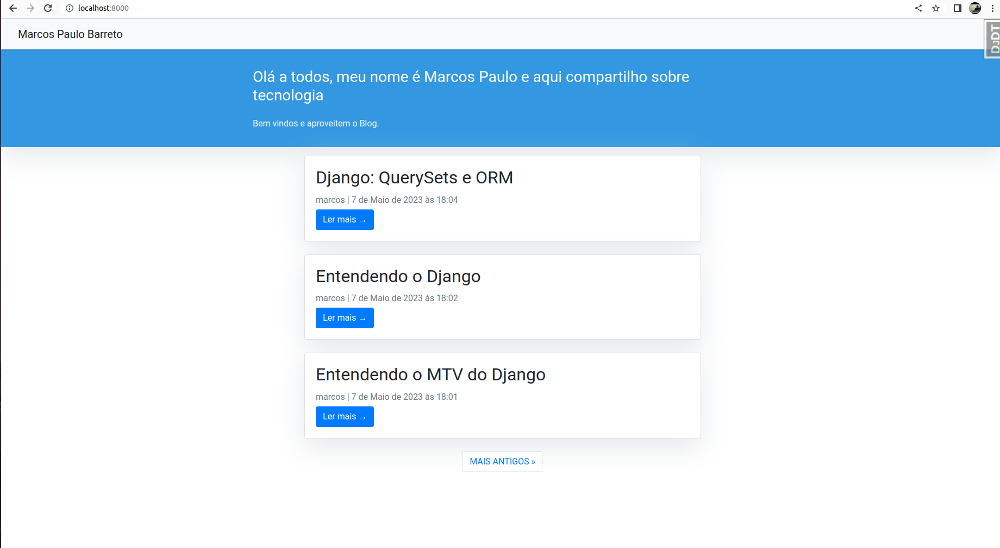
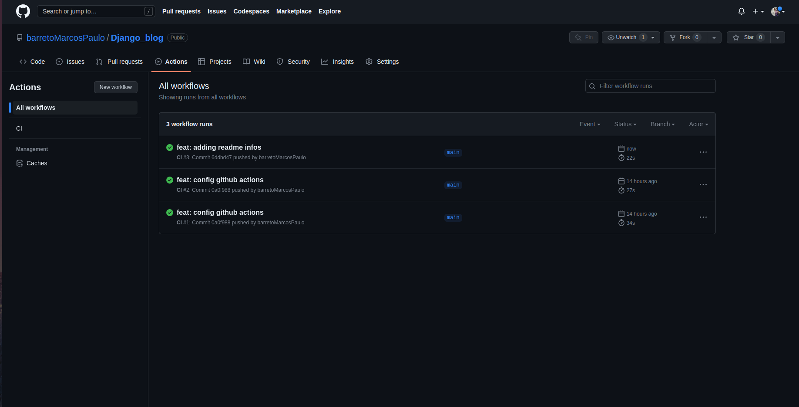
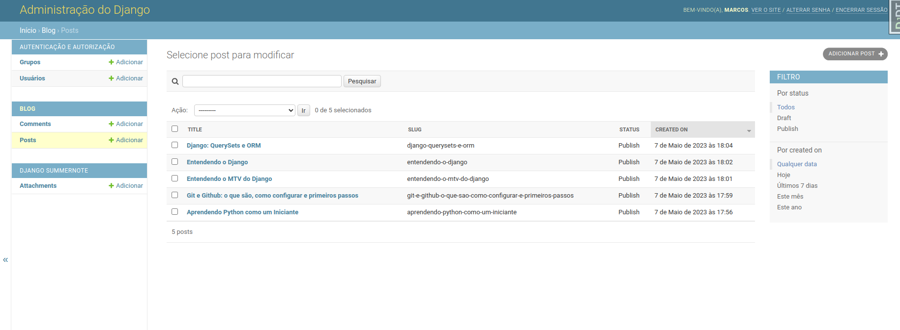
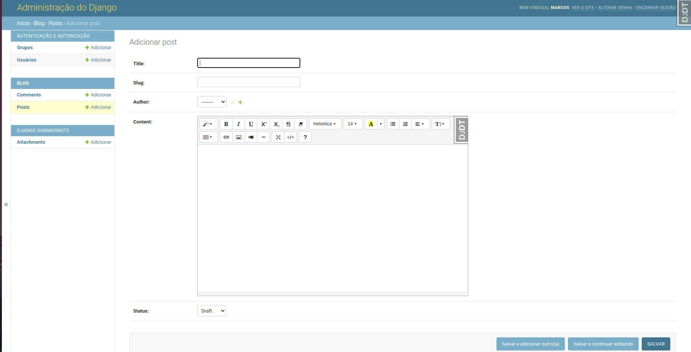
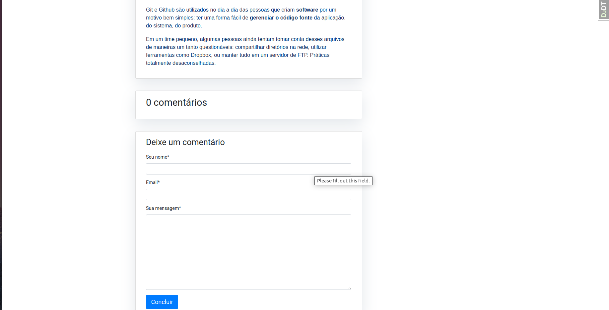
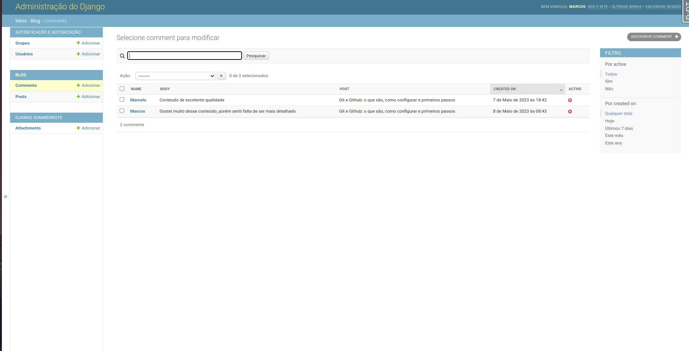
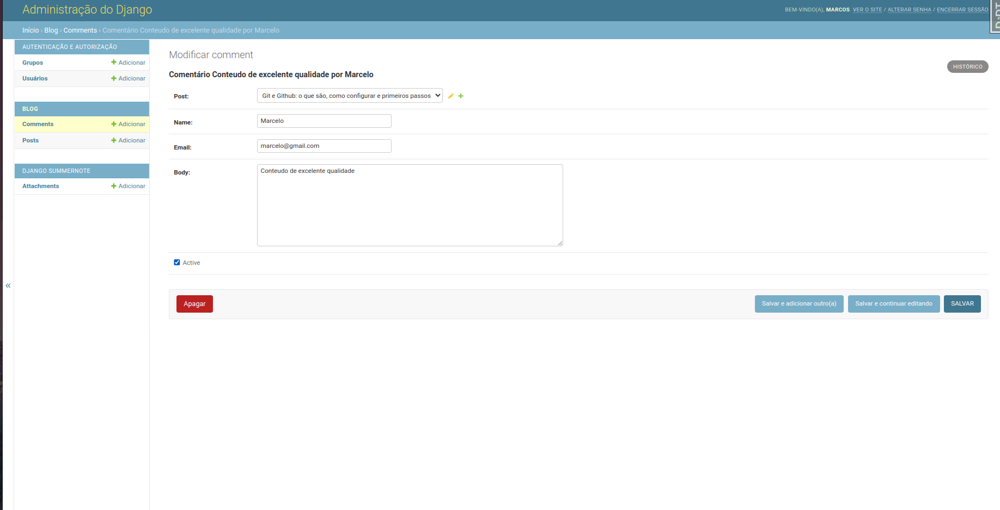

# Django_blog

### Projeto de um blog contruído com o Web Framework Django

## Instruções

### Para executar o projeto utilizando o docker basta executar:
    docker-compose up --build
### caso não queria utilizar o docker:
    pip3 install -r requiremtns.txt
    ./manage.py migrate (Apenas na primeira vez)
    ./manage.py runserver

### Executanto os testes da aplicação
No diretório raiz execute:

    pytest

### Obs: O projeto também conta com o Django Debug Toolbar, para facilitar o processo de debugging da aplicação. O mesmo fica disponível dentro da própria
### plataforma enquanto estiver em modo de DEBUG.

## Tecnologias utilizadas
1. Django 3.2
2. SQLite
3. Pyest
4. Django Debug ToolBar
5. Docker e Docker Compose
6. Summernote WYSIWYG

## Funcionamento

### As postagens são exibidas ordenadas das mais recentes para as mais antigas. Todas as postagens são mostradas na página inicial da aplicação. 

## Github Actions
### Configurei para este projeto uma simples pipeline, onde os testes unitários são executados e a dependencias instaladas

### Para publicar uma postagem é necessário acessar o Django Admin com seu super usuário. Após fazer login você terá acesso a area administrativa onde poderá gerenciar as postagens do blog.

### Uma nova postagem deve possuir um título, uma slug(gerada de forma automatica), autor, conteúdo e o status. A publicação pode ter dois status, o draft que é o rascunho, onde a postagem não aparece no feed para os usuários. Caso você já tenha certeza que o novo post pode ser publicado é só mudar o status para Publish

 

### Os usuários do blog podem interagir com as publicações por meio de comentários. Eles possuem acesso aos comentários quando clicam na opção "Ler mais" de uma publicação

### Os comentários não são publicados diretamente, há a necessidade de uma avaliação de seu conteúdo. Quando o comentário é submetido o adminstrador do blog pode acessa-lo pela area administrativa e ativa-lo para o público.

